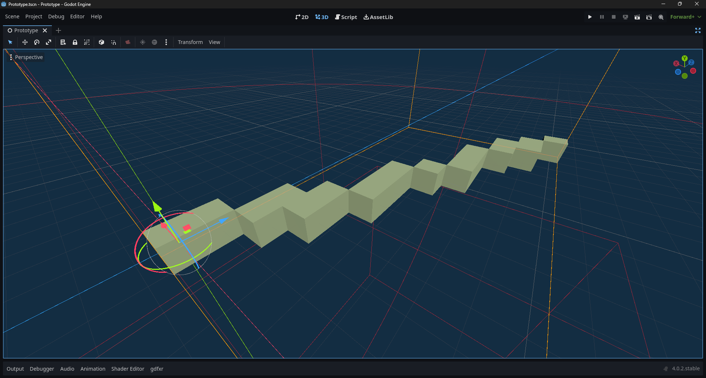

# godot-voxel_line
A Simple plugin for creating voxel lines. (WIP)

<a href="voxel_line.png?raw=true"></a>

## Usage:

``` gdscript
var node : VoxelLine = VoxelLine.new()
add_child(node)

...

var start : Vector3 = Vector3(0, 0, 0)
var end : Vector3 = Vector3(0, 8, 16)
var size : float = 1.0

node.voxel_line(start, end, size, Color.CYAN)

```

<a href="Screenshot 2023-04-11 123609.png?raw=true"></a>

## TODO:

- Materials.
- Multimesh Instances.
- Multiple Lines.
- Editor Parameters.
